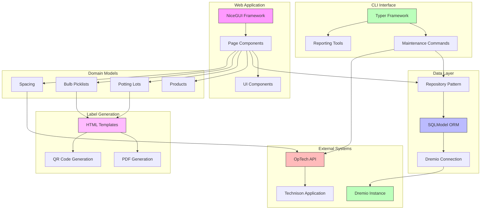

# System Architecture

This document describes the high-level architecture of the Production Control application.

## Overview

The Production Control application helps track the production of potted lilies at Wetering Potlilium. It provides interfaces for managing potting lots, bulb picklists, products, and spacing operations.

## Components

The system consists of the following main components:

### Web Application

- **NiceGUI Framework**: Provides the UI components and routing
- **Page Components**: Specialized pages for different domain areas
- **Reusable UI Components**: Tables, forms, cards, and other UI elements

### Data Layer

- **SQLModel ORM**: Data persistence and object-relational mapping
- **Dremio Integration**: Connection to Dremio data source via Flight protocol
- **Repository Pattern**: Abstracts data access with specialized repositories

### Domain Models

- **Products**: Product catalog and grouping
- **Potting Lots**: Tracking of potted plant batches
- **Bulb Picklists**: Management of bulb selection and allocation
- **Spacing**: Tracking of plant spacing operations

### Label Generation

- **HTML Templates**: Jinja2 templates for label rendering
- **PDF Generation**: WeasyPrint for converting HTML to PDF
- **QR Code Generation**: Creates scannable codes for tracking

### CLI Interface

- **Typer Framework**: Command-line interface for operations
- **Maintenance Commands**: Tools for fixing data issues
- **Reporting**: Display of product and spacing information

### Integration

- **OpTech Client**: Integration with OpTech API for spacing control
- **Dremio Connection**: Access to production data in Dremio

### Python libraries

- Prefer Pydantic over Python's `dataclass`

## Component Diagram

## Key Patterns

- **Repository Pattern**: Each domain model has a corresponding repository that handles data access
- **Component-Based UI**: UI is built from reusable components
- **Template Inheritance**: Label templates use inheritance for consistent styling
- **Command Pattern**: CLI commands encapsulate operations like corrections and fixes

## Data Flow

1. **Web Interface**: Users interact with the system through web pages
1. **Data Access**: Repositories retrieve and store data via SQLModel and Dremio
1. **Label Generation**: HTML templates are rendered and converted to PDF
1. **Integration**: Changes to spacing data are sent to OpTech API

## Performance Considerations

- Label generation for large batches uses table-based templates for better performance
  (see work directory in commit 75c79d41b6ef6d69bd4296c4d01cd305869366cd for performance tests and report)
- Background processing for CPU-intensive operations like PDF generation
- Pagination for large data sets
