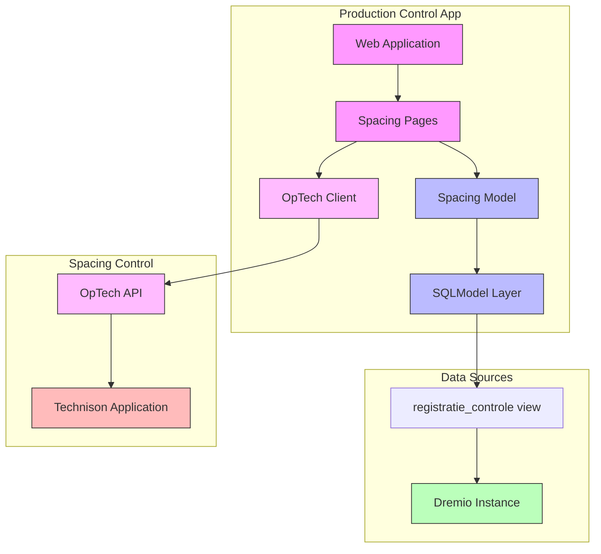

# System Architecture

This document describes the high-level architecture of the Production Control application.

## Components

The system consists of the following main components:

### Production Control App

- **Web Application**: The main user interface
- **SQLModel Layer**: Data persistence and ORM
- **Spacing Pages**: UI components for spacing management
- **Spacing Model**: Domain model for spacing operations
- **OpTech Client**: Integration with OpTech API

### Data Sources

- **Dremio Instance**: Data warehouse
- **registratie_controle view**: View for registration control

### Spacing Control

- **Technison Application**: External spacing control system
- **OpTech API**: API for spacing operations

## Component Diagram

