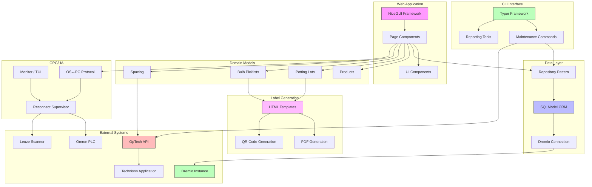

# System Architecture

This document describes the high-level architecture of the Production Control application.

Significant cross-cutting decisions are recorded as ADRs in [`adr/`](adr/README.md).

Companion documents:

- [`protocol.md`](protocol.md) — OS ↔ PC OPC/UA protocol contract.
- [`deployment.md`](deployment.md) — how to deploy and configure
  (env vars, certificate generation, serraserver commands).

## Overview

The Production Control application helps track the production of potted lilies at Wetering Potlilium. It provides interfaces for managing potting lots, bulb picklists, products, and spacing operations.

## Components

The system consists of the following main components:

### Web Application

- **NiceGUI Framework**: Provides the UI components and routing
- **Page Components**: Specialized pages for different domain areas
- **Reusable UI Components**: Tables, forms, cards, and other UI elements

### Data Layer

- **SQLModel ORM**: Data persistence and object-relational mapping
- **Dremio Integration**: Connection to Dremio data source via Flight protocol
- **Repository Pattern**: Abstracts data access with specialized repositories

### Domain Models

- **Products**: Product catalog and grouping
- **Potting Lots**: Tracking of potted plant batches
- **Bulb Picklists**: Management of bulb selection and allocation
- **Spacing**: Tracking of plant spacing operations

### Label Generation

- **HTML Templates**: Jinja2 templates for label rendering
- **PDF Generation**: WeasyPrint for converting HTML to PDF
- **QR Code Generation**: Creates scannable codes for tracking

### CLI Interface

- **Typer Framework**: Command-line interface for operations
- **Maintenance Commands**: Tools for fixing data issues
- **Reporting**: Display of product and spacing information

### OPC/UA Machine Communication

Two cooperating roles share the same connection layer:

- **Monitor / TUI** (`src/production_control/opcua/`): discover-and-subscribe
  loop against the Omron PLC, plus a fixed-node subscription against the
  Leuze scanner. Used for diagnostics. Entry points:
  `python -m production_control.opcua.monitor` (JSONL on stdout) and
  `python -m production_control.opcua.tui` (Textual UI over ssh).
- **Protocol layer** (planned at `src/production_control/opcua/protocol/`):
  long-running subscription inside the web app process that owns the
  OS ↔ PC contract — parses Leuze scans, writes `ScanResultaat` and
  `ActievePartijnummer{1,2}` on the PLC, exposes UI hooks. See
  [`protocol.md`](protocol.md).

Shared building blocks:

- **asyncua library**: Python OPC/UA client for reading, writing and
  subscribing to PLC node values. Security is `Basic256Sha256` with
  `SignAndEncrypt`; the same client cert is presented to both servers.
- **Configuration**: all `VINEAPP_OPCUA_*` env vars; see
  [`deployment.md`](deployment.md).
- **Reconnect supervisor**: exponential backoff with a give-up threshold;
  one source's failure does not affect the other.
- **Leuze cert workaround**: `LenientCertificate` monkey-patch in
  `src/production_control/opcua/leuze.py` to handle the scanner's
  malformed server cert.
- **Node addressing**: string-based NodeIds (e.g.
  `ns=4;s=OPCScanner/fbOPC/ScanResultaat`) so namespace index changes
  don't break behavior.

### Integration

- **OpTech Client**: Integration with OpTech API for spacing control
- **Dremio Connection**: Access to production data in Dremio

### Python libraries

- Prefer Pydantic over Python's `dataclass`

## Component Diagram


```mermaid
graph TD
    subgraph "Web Application"
        NiceGUI[NiceGUI Framework]
        Pages[Page Components]
        UIComponents[UI Components]
    end
    
    subgraph "Data Layer"
        SQLModel[SQLModel ORM]
        Repositories[Repository Pattern]
        DremioConn[Dremio Connection]
    end
    
    subgraph "Domain Models"
        Products[Products]
        PottingLots[Potting Lots]
        BulbPicklists[Bulb Picklists]
        Spacing[Spacing]
    end
    
    subgraph "Label Generation"
        Templates[HTML Templates]
        PDFGen[PDF Generation]
        QRCodes[QR Code Generation]
    end
    
    subgraph "CLI Interface"
        Typer[Typer Framework]
        Commands[Maintenance Commands]
        Reporting[Reporting Tools]
    end
    
    subgraph "OPC/UA"
        Monitor[Monitor / TUI]
        Protocol[OS↔PC Protocol]
        Supervisor[Reconnect Supervisor]
    end

    subgraph "External Systems"
        Dremio[Dremio Instance]
        OpTech[OpTech API]
        Technison[Technison Application]
        PLC[Omron PLC]
        Leuze[Leuze Scanner]
    end

    NiceGUI --> Pages
    Pages --> UIComponents
    Pages --> Repositories
    
    Repositories --> SQLModel
    SQLModel --> DremioConn
    DremioConn --> Dremio
    
    Pages --> Products
    Pages --> PottingLots
    Pages --> BulbPicklists
    Pages --> Spacing
    
    PottingLots --> Templates
    BulbPicklists --> Templates
    Templates --> PDFGen
    Templates --> QRCodes
    
    Typer --> Commands
    Typer --> Reporting
    Commands --> Repositories
    Commands --> OpTech
    
    Spacing --> OpTech
    OpTech --> Technison

    Pages --> Protocol
    Protocol --> Supervisor
    Monitor --> Supervisor
    Supervisor --> PLC
    Supervisor --> Leuze

    style NiceGUI fill:#f9f,stroke:#333
    style SQLModel fill:#bbf,stroke:#333
    style Templates fill:#fbf,stroke:#333
    style Typer fill:#bfb,stroke:#333
    style OpTech fill:#fbb,stroke:#333
    style Dremio fill:#bfb,stroke:#333
```

## Key Patterns

- **Repository Pattern**: Each domain model has a corresponding repository that handles data access
- **Component-Based UI**: UI is built from reusable components
- **Template Inheritance**: Label templates use inheritance for consistent styling
- **Command Pattern**: CLI commands encapsulate operations like corrections and fixes
- **Lazy Loading**: Global repository instances are created on-demand to avoid initialization-time issues
- **FastAPI Async Patterns**: Route handlers follow FastAPI best practices for async/sync declarations

## Data Flow

1. **Web Interface**: Users interact with the system through web pages
1. **Data Access**: Repositories retrieve and store data via SQLModel and Dremio
1. **Label Generation**: HTML templates are rendered and converted to PDF
1. **Integration**: Changes to spacing data are sent to OpTech API
1. **Machine Communication**: Active lot numbers are written to the potting line PLC via OPC/UA

## Performance Considerations

- Label generation for large batches uses table-based templates for better performance
  (see work directory in commit 75c79d41b6ef6d69bd4296c4d01cd305869366cd for performance tests and report)
- Background processing for CPU-intensive operations like PDF generation
- Pagination for large data sets

## Route Handler Patterns

The application follows FastAPI best practices for route handler declarations:

- **Use `def` (sync) for database operations**: Routes that perform synchronous database operations using SQLModel/SQLAlchemy should use regular `def` functions for optimal FastAPI performance
- **Use `async def` only with `await`**: Routes should only be declared as `async def` when they use libraries that support `await` (e.g., async HTTP clients, async database drivers)
- **Lazy repository loading**: Global repository instances use lazy loading to avoid initialization-time environment variable issues in production

### Examples

```python
# Correct: Sync route for synchronous database operations
@router.page("/{id}")
def product_detail(id: int) -> None:
    product = get_repository().get_by_id(id)
    # ... render UI

# Correct: Async route only when using await
@router.page("/")
async def async_operation() -> None:
    result = await some_async_library()
    # ... render UI
```

This pattern prevents database connection issues and ensures optimal FastAPI performance.
