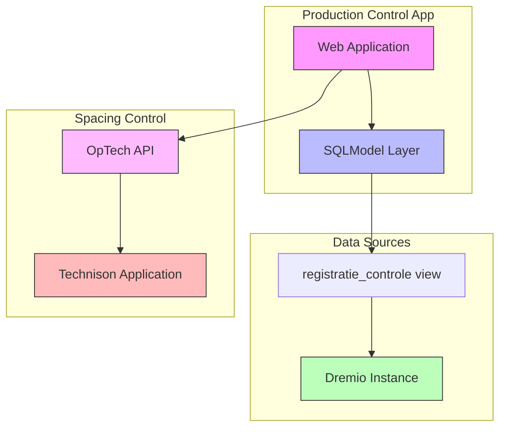

# Backlog

This backlog describes the product increments we have to build to realize our product vision.

## System Architecture

## Next

- Goal: User can track spacing process segment

  - Create functionality to record spacing operations (new and historical)
  - Enable correction of ~200 lots with incorrect spacing data from January 2023
  - Must be completed this week
  - Critical for accurate cost determination per lot
  - Impacts greenhouse space utilization tracking

  Implementation steps:

  1. Create example script to:
     - Connect to local test environment
     - Retrieve first 100 rows from `Productie.Controle."registratie_controle"` view
     - Define SQLModel based on the retrieved dataset
  1. Integrate SQLModel into web application:
     - Add model to application structure
     - Create list view of spacing records
  1. Implement correction functionality:
     - Create editor interface for spacing records
     - Integrate with OpTech API to send corrections to Technison
     - Implement validation and error handling

## Later

- Goal: User can see greenhouse utilization

  - Leverage spacing data to calculate actual space usage
  - Track greenhouse area utilization changes due to spacing operations

- Goal: User can plan spacing scheduling details

  - Build on accurate spacing tracking and utilization data

- Goal: User can track potting process segment

  - Integration with spacing tracking for complete process view

- Goal: Improve test coverage

  - Increase coverage of web interface components
  - Add tests for __web__.py (currently 0% coverage)
  - Improve home page test coverage (currently 36%)
  - Focus on critical user paths and error scenarios

- Goal: Improve products list view

  - Move table state to instance scope for better multi-user support
  - Add loading states during data fetches
  - Add error handling for failed data fetches
  - Add clear button to search input for better UX

- Goal: Wrap up project

  - Review the project
  - Review the cookiecutter-vine-app template that we used to start this repository with.
