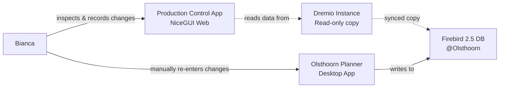

# Doing

## Context

- **Current workflow problem**: Bianca uses the NiceGUI web app ([inspectie.py](src/production_control/web/pages/inspectie.py)) to record inspection changes (afwijking values via +1/-1 buttons), then manually re-enters these changes into a desktop app to persist them in the Olsthoorn production Firebird 2.5 database
- **Current state**: Changes are stored in browser storage only (see `get_pending_commands()` in [inspectie.py:31](src/production_control/web/pages/inspectie.py#L31))
- **Database setup**:
  - Production: Firebird 2.5 instance at Olsthoorn
  - Local dev: Dremio instance with copy of production Firebird data (table: `Productie.Planning.teeltpl`)
- **Data to persist**: `afwijking_afleveren` values from inspection rounds, tracked by `code` field

## Goal

Enable the NiceGUI app to persist afwijking changes directly to the Firebird database, eliminating duplicate data entry.

## Current System Architecture

## Tasks

- [x] Setup local Firebird 2.5 test database in Docker
- [x] Read schema from local Dremio copy (`Productie.Planning.teeltpl` table)
- [x] Verify/create table structure in Firebird database
- [x] Create FastAPI endpoint to update afwijking values in Firebird
  - Endpoint should handle `UpdateAfwijkingCommand` (code, new_afwijking)
- [x] Modify [inspectie.py](src/production_control/web/pages/inspectie.py) to call the API when changes are committed
  - Wire up existing pending commands to API call
- [x] Test locally with Docker Firebird instance

## Completed Implementation

All tasks completed successfully! See [firebird-integration-summary.md](firebird-integration-summary.md) for full details.

### What Works Now

1. **Firebird 2.5 Database**: Running in Docker on port 3050 with full schema and 2,995 rows of data
2. **FastAPI Service**: `/api/firebird/update-afwijking` endpoint to persist changes
3. **Web UI**: "Opslaan in database" button in inspectie page to commit pending changes
4. **Tested**: Successfully verified updates are persisted to Firebird database

### Key Files

- Docker setup: `docker-compose.yml`
- Schema: `scripts/firebird/01_create_schema.sql`
- Seeding: `scripts/firebird/seed_db.py`
- API: `src/production_control/firebird/api.py`
- Connection: `src/production_control/firebird/connection.py`
- UI: `src/production_control/web/pages/inspectie.py`

### Next Steps for Production

1. Configure environment variables to point to production Firebird database at Olsthoorn
2. Test with Bianca to validate the workflow
3. Monitor for any errors during initial deployment
4. Keep manual desktop app workflow as fallback initially
