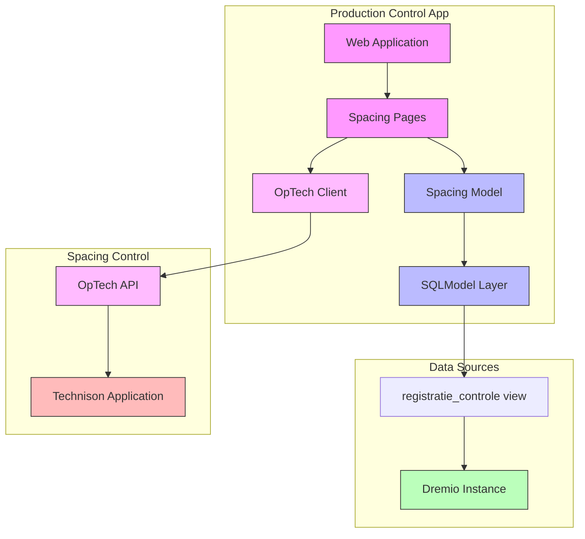

# Doing

In this document we describe what we are working on now.

## Goal: User can track spacing process segment

- Create functionality to record spacing operations (new and historical)
- Enable correction of ~200 lots with incorrect spacing data from January 2023
- Must be completed this week
- Critical for accurate cost determination per lot
- Impacts greenhouse space utilization tracking

Implementation steps:

1. ✓ Create example script to:
   - Connect to local test environment
   - Retrieve first 100 rows from `Productie.Controle."registratie_controle"` view
   - Define SQLModel based on the retrieved dataset
1. Integrate SQLModel into web application:
   - ✓ Add model to application structure
   - ✓ Create list view of spacing records:
     - ✓ Basic table structure with Dutch labels
     - ✓ Initial data loading
     - ✓ Search functionality
     - ✓ Add table request handler for pagination and sorting
     - ✓ Test pagination controls (next/previous, page size)
     - ✓ Test sorting on all sortable columns
     - ✓ Add all model fields to table with appropriate Dutch labels
     - ✓ Add menu item for spacing page
1. Refactor table components:
   - ✓ Use Dutch labels for the product page
   - ✓ Enhance models with UI metadata for label, hide in the ui, and sortable
   - ✓ Create table column generator:
     - ✓ Extract columns from model metadata
     - ✓ Support field filtering (hidden fields)
     - ✓ Handle field ordering
     - ✓ Apply formatters based on type hints
   - Create DataTable component:
     - ✓ Create base DataTable that wraps column generation from model
     - Add server-side pagination support (next)
     - Add custom actions support
     - Update products page to use DataTable
     - Update spacing page to use DataTable
     - Add tests for DataTable component
   - Create table data formatter utility:
     - Add date formatting
     - Add decimal formatting
     - Support custom field formatting
1. Integrate into command line application
   - List records with an error
   - List record with a specific error
1. Implement correction functionality:
   - Integrate into the CLI applications. Retrieve specific errors and for each record with that error, issue a correcting command.
   - Create editor interface for spacing records
   - Integrate with OpTech API to send corrections to Technison
   - Implement validation and error handling

## Design

### System Architecture

### Implementation Details

#### Python Modules

1. `src/production_control/spacing/models.py`
   - ✓ WijderzetRegistratie model (SQLModel)
   - ✓ SpacingRepository for data access
   - Error handling classes

2. `src/production_control/spacing/api.py`
   - OpTechClient for API integration
   - Request/response models
   - Error handling

3. `src/production_control/web/pages/spacing.py`
   - Spacing overview page (list view):
     - ✓ Basic table structure
     - ✓ Search functionality
     - ✓ Add all model fields
     - ✓ Fix pagination
     - ✓ Fix sorting
   - Spacing detail/edit page
   - Error handling and user feedback

4. `src/production_control/web/components/data_table.py` (New)
   - Base table component with:
     - ✓ Model-driven columns
     - Server-side pagination (next)
     - Custom actions support
     - Event handling
   - Table formatter utilities:
     - Date formatting
     - Decimal formatting
     - Custom field formatting

#### Web Pages

1. Spacing Overview Page (`/spacing`)
   - List of spacing records with:
     - ✓ Basic info (batch code, product, group)
     - ✓ Add all dates (potting, spacing)
     - ✓ Add all table counts and densities
     - ✓ Spacing error indicators
     - Links to detail/edit pages
   - ✓ Search functionality
   - ✓ Fix pagination and sorting
   - Error status overview

2. Spacing Detail/Edit Page (`/spacing/{batch_id}`)
   - Detailed view of spacing record
   - Edit form for corrections
   - Validation feedback
   - Save/cancel actions
   - Integration with OpTech API
