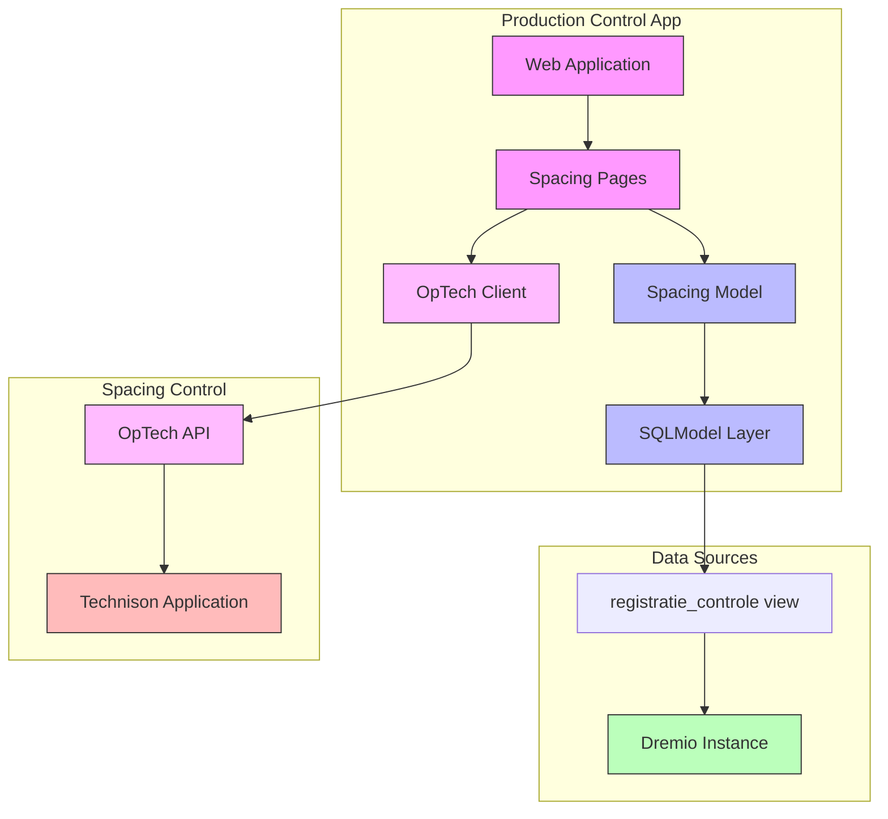

# Doing

In this document we describe what we are working on now.

## Goal: User can track spacing process segment

- Create functionality to record spacing operations (new and historical)
- Enable correction of ~200 lots with incorrect spacing data from January 2023
- Must be completed this week
- Critical for accurate cost determination per lot
- Impacts greenhouse space utilization tracking

Implementation steps:

1. ✓ Create example script to:
   - Connect to local test environment
   - Retrieve first 100 rows from `Productie.Controle."registratie_controle"` view
   - Define SQLModel based on the retrieved dataset
1. Integrate SQLModel into web application:
   - ✓ Add model to application structure
   - Create list view of spacing records
1. Integrate into command line application
   - List records with an error
   - List record with a specific error
1. Implement correction functionality:
   - Integrate into the CLI applications. Retrieve specific errors and for each record with that error, issue a correcting command.
   - Create editor interface for spacing records
   - Integrate with OpTech API to send corrections to Technison
   - Implement validation and error handling

Next steps:
1. Create spacing list view page using NiceGUI
2. Add error filtering to repository
3. Implement CLI commands for error listing

## Design

### System Architecture

### Implementation Details

#### Python Modules

1. `src/production_control/spacing/models.py`
   - ✓ WijderzetRegistratie model (SQLModel)
   - ✓ SpacingRepository for data access
   - Error handling classes

2. `src/production_control/spacing/api.py`
   - OpTechClient for API integration
   - Request/response models
   - Error handling

3. `src/production_control/web/pages/spacing.py`
   - Spacing overview page (list view)
   - Spacing detail/edit page
   - Error handling and user feedback

#### Web Pages

1. Spacing Overview Page (`/spacing`)
   - List of spacing records with:
     - Batch code and product info
     - Current table counts
     - Spacing error indicators
     - Links to detail/edit pages
   - Filtering and pagination
   - Error status overview

2. Spacing Detail/Edit Page (`/spacing/{batch_id}`)
   - Detailed view of spacing record
   - Edit form for corrections
   - Validation feedback
   - Save/cancel actions
   - Integration with OpTech API
