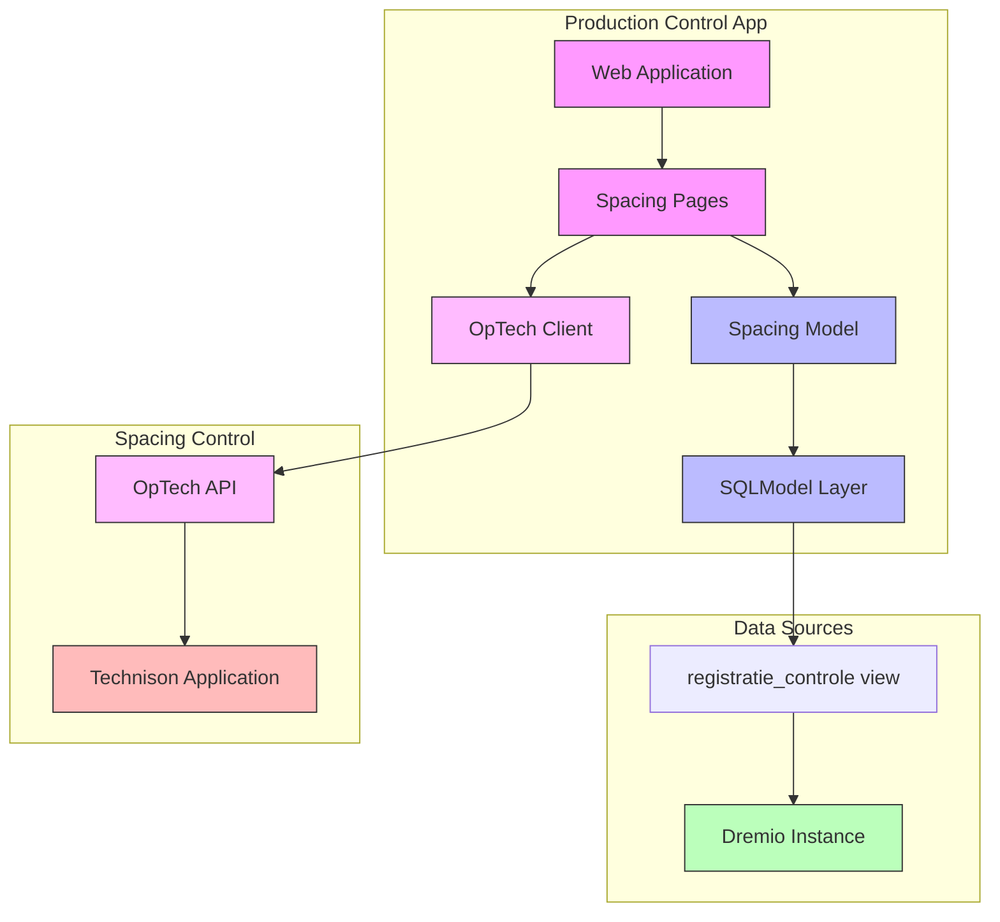

# Doing

In this document we describe what we are working on now.

## Goal: User can track spacing process segment

- Create functionality to record spacing operations (new and historical)
- Enable correction of ~200 lots with incorrect spacing data from January 2023
- Must be completed this week
- Critical for accurate cost determination per lot
- Impacts greenhouse space utilization tracking

Implementation steps:

1. ✓ Create example script to:
   - Connect to local test environment
   - Retrieve first 100 rows from `Productie.Controle."registratie_controle"` view
   - Define SQLModel based on the retrieved dataset
1. ✓ Integrate SQLModel into web application:
   - ✓ Add model to application structure
   - ✓ Create list view of spacing records:
     - ✓ Basic table structure with Dutch labels
     - ✓ Initial data loading
     - ✓ Search functionality
     - ✓ Add table request handler for pagination and sorting
     - ✓ Test pagination controls (next/previous, page size)
     - ✓ Test sorting on all sortable columns
     - ✓ Add all model fields to table with appropriate Dutch labels
     - ✓ Add menu item for spacing page
1. ✓ Refactor table components:
   - ✓ Use Dutch labels for the product page
   - ✓ Enhance models with UI metadata for label, hide in the ui, and sortable
   - ✓ Create table column generator:
     - ✓ Extract columns from model metadata
     - ✓ Support field filtering (hidden fields)
     - ✓ Handle field ordering
     - ✓ Apply formatters based on type hints
   - ✓ Create ServerSidePaginatingTable:
     - ✓ Model-driven columns
     - Server-side pagination support
       - ✓ State should be stored per client connection, not globally
       - ✓ little repeated code between pages
       - ✓ uncluttered code in pages
       - ✓ Pagination interface should be clean python
     - ✓ Update products page to use table
   - ✓ Refactor repositories:
     - ✓ Make DremioRepository generic with model type T
     - ✓ Move common functionality to base class
     - ✓ Keep session handling in repositories
     - ✓ Update both repositories to use generic base class
   - ✓ Update existing pages:
     - ✓ Update spacing page to use ServerSidePaginatingTable:
       - ✓ Replace global table_data with ClientStorageTableState
       - ✓ Use server_side_paginated_table component
       - ✓ Improve code organization (setup, handlers, rendering)
       - ✓ Clean up pagination handling
     - ✓ Add tests for shared components
   - ✓ Create table data formatter utility:
     - ✓ Add date formatting
     - ✓ Add decimal formatting
     - ✓ Support custom field formatting
1. ✓ Integrate into command line application
   - ✓ List wdz records with an error
   - ✓ List record with a specific error
1. ✓ Add error visualization:
   - ✓ show aantal_tafels_oppotten_plan and aantal_planten_gerealiseerd in the table
   - ✓ hide the Fout column
   - ✓ add view button to show record details
   - ✓ add warning emoji column to indicate errors
1. Create correction functionality:
   - ✓ Create editor interface for spacing records
     - ✓ Fields that are editable are `aantal wz1` and `aantal wz2`.
     - ✓ If those fields are changed, a message needs to be sent to the optech application to register the correction.
   - Design save functionality:
     1. ✓ Create a CorrectSpacingRecord command as a Pydantic model.
     2. ✓ Create OpTechClient class in spacing/optech.py:
        - ✓ Handles CorrectSpacingRecord command.
        - ✓ Method to send correction: `send_correction(partij_code: str, aantal_wz1: Optional[int], aantal_wz2: Optional[int])`
   - ✓ Integrate with OpTech API to send corrections to Technison
     - ✓ See docs at: http://optech.localhost/docs#/Partij/update_wijderzet_api_partij__partij_code__wijderzet_put
     - ✓ Base url for api should be set as env var.
     - ✓ Handle API errors and return success/failure status
     - ✓ Show error messages in UI
     - ✓ Increase timeout to 25 seconds
     - ✓ Refresh table data on success
   - ✓ add field to spacing record, `datum_laatste_wdz`
     - ✓ only show records where this field <> null
     - ✓ map to the db field of the same name
     - ✓ order descending on this field
   - Review validation and error handling
   - Integrate into the CLI applications.
     Retrieve specific errors and for each record with that error, issue a correcting command.
     Reuse optech client logic

## Design

### System Architecture

### Implementation Details

#### Python Modules

1. `src/production_control/spacing/optech.py` (New)
   - OpTechClient class for API integration
   - Error handling and response types
   - API endpoint configuration

2. `src/production_control/spacing/models.py` (Update)
   - Add update method to SpacingRepository
   - Add validation for spacing values

3. `src/production_control/web/pages/spacing.py` (Update)
   - Add save handler to correction page
   - Add success/error notifications
   - Add validation feedback

#### Tests

1. `tests/spacing/test_optech.py` (New)
   - Test OpTechClient with mocked API
   - Test error handling
   - Test response parsing

2. `tests/test_spacing_models.py` (Update)
   - Test SpacingRepository update method
   - Test validation rules

3. `tests/web/test_spacing_edit.py` (Update)
   - Test save functionality
   - Test validation feedback
   - Test error handling
