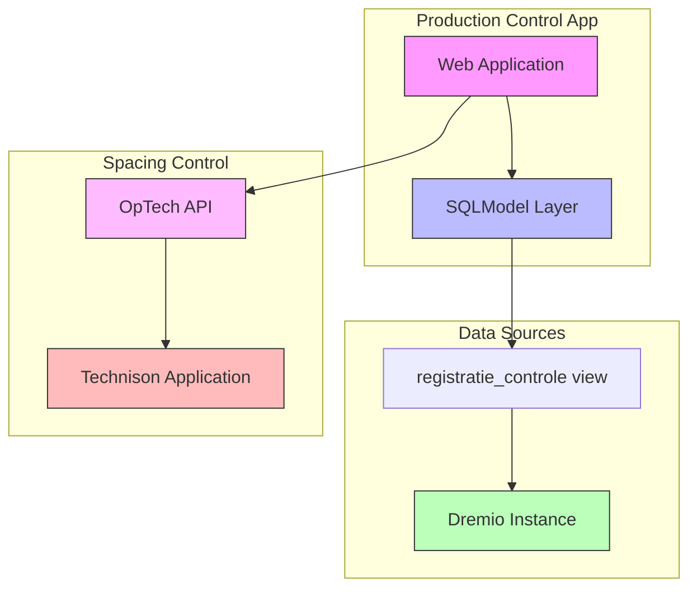

# Doing

In this document we describe what we are working on now.

## Goal: User can track spacing process segment

- Create functionality to record spacing operations (new and historical)
- Enable correction of ~200 lots with incorrect spacing data from January 2023
- Must be completed this week
- Critical for accurate cost determination per lot
- Impacts greenhouse space utilization tracking

Implementation steps:

1. Create example script to:
   - Connect to local test environment
   - Retrieve first 100 rows from `Productie.Controle."registratie_controle"` view
   - Define SQLModel based on the retrieved dataset
1. Integrate SQLModel into web application:
   - Add model to application structure
   - Create list view of spacing records
1. Implement correction functionality:
   - Create editor interface for spacing records
   - Integrate with OpTech API to send corrections to Technison
   - Implement validation and error handling

## Design

### System Architecture

