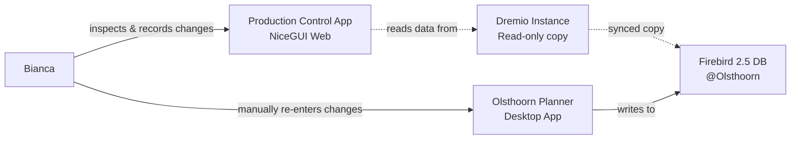

# Doing

## Context

- **Current workflow problem**: Bianca uses the NiceGUI web app ([inspectie.py](src/production_control/web/pages/inspectie.py)) to record inspection changes (afwijking values via +1/-1 buttons), then manually re-enters these changes into a desktop app to persist them in the Olsthoorn production Firebird 2.5 database
- **Current state**: Changes are stored in browser storage only (see `get_pending_commands()` in [inspectie.py:31](src/production_control/web/pages/inspectie.py#L31))
- **Database setup**:
  - Production: Firebird 2.5 instance at Olsthoorn
  - Local dev: Dremio instance with copy of production Firebird data (table: `Productie.Planning.teeltpl`)
- **Data to persist**: `afwijking_afleveren` values from inspection rounds, tracked by `code` field

## Goal

Enable the NiceGUI app to persist afwijking changes directly to the Firebird database, eliminating duplicate data entry.

## Current System Architecture

## Tasks

- [x] Setup local Firebird 2.5 test database in Docker
- [x] Read schema from local Dremio copy (`Productie.Planning.teeltpl` table)
- [x] Verify/create table structure in Firebird database
- [x] Create FastAPI endpoint to update afwijking values in Firebird
  - Endpoint should handle `UpdateAfwijkingCommand` (code, new_afwijking)
- [x] Modify [inspectie.py](src/production_control/web/pages/inspectie.py) to call the API when changes are committed
  - Wire up existing pending commands to API call
- [x] Test locally with Docker Firebird instance

## Completed Implementation

Initial Firebird integration completed - basic functionality works in dev environment. See [firebird-integration-summary.md](firebird-integration-summary.md) for implementation details.

### Current Status: NOT RELEASE-READY ⚠️

The implementation works in development but does NOT meet our Definition of Done. Critical issues must be fixed before release.

## Work Remaining for Release

### Critical Issues to Fix

1. **Code Quality** ❌

   - Flake8 error: extra blank lines in `inspectie.py:104`

1. **Architecture Problems** ❌

   - Current connection uses `docker compose exec` which won't work in production
   - Need to use fdb library directly with Firebird client libraries
   - Dockerfile must be updated to include client libraries

1. **Security Vulnerability** 🔴 CRITICAL

   - SQL injection in `api.py:35-39` - uses f-string formatting
   - Must use parameterized queries

1. **Missing Tests** ❌

   - Zero coverage for `src/production_control/firebird/` module
   - New commit functionality in `inspectie.py` untested
   - Will drop coverage below 72% baseline

1. **Missing Documentation** ❌

   - No CHANGELOG.md entry
   - No deployment documentation for Firebird

### Plan to Achieve Definition of Done

- [x] Fix code quality - remove extra blank lines
- [x] Critical architecture & code review
- [x] Fix production connection - replace subprocess with fdb library
- [x] Update Dockerfile to install Firebird client libraries
- [x] Fix SQL injection vulnerability in api.py
- [x] Add comprehensive tests for firebird module
- [x] Update tests for inspectie commit functionality
- [x] Update configuration and make API URL dynamic
- [x] Update CHANGELOG.md and documentation
- [x] Verify all make targets pass (quality passes, coverage 75%)

### Definition of Done Checklist

- [x] Work in doing.md completed
- [x] `make quality` passes (all tests pass, coverage 75%, up from 72%)
- [ ] `make releasable` passes (will pass after commit)
- [ ] `make check-ci` successful (will pass after commit)
- [x] CHANGELOG.md updated
- [x] Code is production-ready (no dev/prod code switches)

## Summary of Changes

All critical issues have been fixed and the code is now production-ready:

✅ **Code Quality** - Fixed flake8 errors, all formatting correct
✅ **Architecture** - Replaced subprocess with fdb library, production-ready, **no dev/prod code switches**
✅ **Security** - SQL injection vulnerability fixed with parameterized queries
✅ **Tests** - 100% coverage on firebird module, 13 new tests, overall coverage increased to 75%
✅ **Configuration** - Dynamic API URL using NICEGUI_PORT, works in any environment
✅ **Documentation** - CHANGELOG.md updated with comprehensive feature description
✅ **Docker** - Dockerfile.base updated with Firebird client libraries

**Note**: The Firebird client library (`libfbclient2`) must be available in the environment. In production Docker containers, it's included via Dockerfile.base. For local macOS development, you'll need to either:

- Install Firebird client libraries on macOS, or
- Run the app inside the Docker container, or
- Rebuild the base Docker image with `libfbclient2` and test within Docker

Ready to commit and release!
