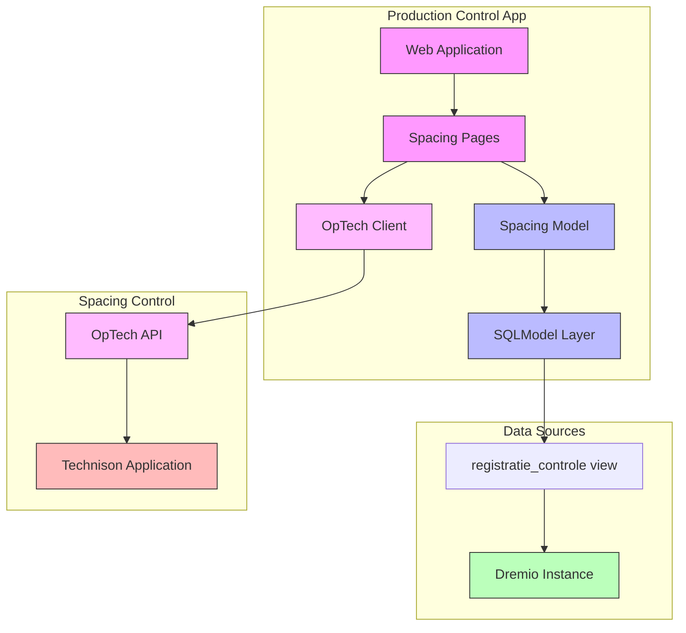

# Doing

In this document we describe what we are working on now.

## Goal: User can track spacing process segment

- Create functionality to record spacing operations (new and historical)
- Enable correction of ~200 lots with incorrect spacing data from January 2023
- Must be completed this week
- Critical for accurate cost determination per lot
- Impacts greenhouse space utilization tracking

Implementation steps:

1. ✓ Create example script to:
   - Connect to local test environment
   - Retrieve first 100 rows from `Productie.Controle."registratie_controle"` view
   - Define SQLModel based on the retrieved dataset
1. Integrate SQLModel into web application:
   - ✓ Add model to application structure
   - ✓ Create list view of spacing records:
     - ✓ Basic table structure with Dutch labels
     - ✓ Initial data loading
     - ✓ Search functionality
     - ✓ Add table request handler for pagination and sorting
     - ✓ Test pagination controls (next/previous, page size)
     - ✓ Test sorting on all sortable columns
     - ✓ Add all model fields to table with appropriate Dutch labels
     - ✓ Add menu item for spacing page
1. Refactor table components:
   - ✓ Use Dutch labels for the product page
   - ✓ Enhance models with UI metadata for label, hide in the ui, and sortable
   - ✓ Create table column generator:
     - ✓ Extract columns from model metadata
     - ✓ Support field filtering (hidden fields)
     - ✓ Handle field ordering
     - ✓ Apply formatters based on type hints
   - ✓ Create ServerSidePaginatingTable:
     - ✓ Model-driven columns
     - Server-side pagination support
       - ✓ State should be stored per client connection, not globally
       - ✓ little repeated code between pages
       - ✓ uncluttered code in pages
       - ✓ Pagination interface should be clean python
     - ✓ Update products page to use table
   - ✓ Refactor repositories:
     - ✓ Make DremioRepository generic with model type T
     - ✓ Move common functionality to base class
     - ✓ Keep session handling in repositories
     - ✓ Update both repositories to use generic base class
   - ✓ Update existing pages:
     - ✓ Update spacing page to use ServerSidePaginatingTable:
       - ✓ Replace global table_data with ClientStorageTableState
       - ✓ Use server_side_paginated_table component
       - ✓ Improve code organization (setup, handlers, rendering)
       - ✓ Clean up pagination handling
     - ✓ Add tests for shared components
   - ✓ Create table data formatter utility:
     - ✓ Add date formatting
     - ✓ Add decimal formatting
     - ✓ Support custom field formatting
1. ✓  Integrate into command line application
   - ✓ List wdz records with an error
   - ✓  List record with a specific error
1. Implement correction functionality:
   - ✓ show `aantal_tafels_oppotten_plan` and `aantal_planten_gerealiseerd` in the table
   - ✓ hide the `Fout` column
   - View details action, like in product.py. Now gives error: Error: 'SpacingRepository' object has no attribute 'get_by_id'
   - but make the row color-warn if there is an error
   - Create editor interface for spacing records
   - Integrate into the CLI applications. Retrieve specific errors and for each record with that error, issue a correcting command.
   - Integrate with OpTech API to send corrections to Technison
   - Implement validation and error handling

## Notes

You can use scoped slots to conditionally format the content of a cell. See the Quasar documentation for more information about body-cell slots.

In this demo we use a q-badge to display the age in red if the person is under 21 years old. We use the body-cell-age slot to insert the q-badge into the age column. The ":color" attribute of the q-badge is set to "red" if the age is under 21, otherwise it is set to "green". The colon in front of the "color" attribute indicates that the value is a JavaScript expression.

```python
main.py
from nicegui import ui

columns = [
    {'name': 'name', 'label': 'Name', 'field': 'name'},
    {'name': 'age', 'label': 'Age', 'field': 'age'},
]
rows = [
    {'name': 'Alice', 'age': 18},
    {'name': 'Bob', 'age': 21},
    {'name': 'Carol', 'age': 42},
]
table = ui.table(columns=columns, rows=rows, row_key='name')
table.add_slot('body-cell-age', '''
    <q-td key="age" :props="props">
        <q-badge :color="props.value < 21 ? 'red' : 'green'">
            {{ props.value }}
        </q-badge>
    </q-td>
''')

ui.run()
```

## Design

### System Architecture



### Implementation Details

#### Python Modules

1. `src/production_control/spacing/models.py`
   - ✓ WijderzetRegistratie model (SQLModel)
   - ✓ SpacingRepository for data access
   - Error handling classes

2. `src/production_control/spacing/api.py`
   - OpTechClient for API integration
   - Request/response models
   - Error handling

3. `src/production_control/web/pages/spacing.py`
   - Spacing overview page (list view):
     - ✓ Basic table structure
     - ✓ Search functionality
     - ✓ Add all model fields
     - ✓ Fix pagination
     - ✓ Fix sorting
     - Refactor to use shared components:
       - Replace global table_data with ClientStorageTableState
       - Use server_side_paginated_table component
       - Improve code organization
       - Clean up pagination handling
   - Spacing detail/edit page
   - Error handling and user feedback

4. `src/production_control/web/components/data_table.py` (New)
   - ✓ Base table component with:
     - ✓ Model-driven columns
     - ✓ Server-side pagination
     - ✓ Event handling
   - ✓ Table formatter utilities:
     - ✓ Date formatting
     - ✓ Decimal formatting
     - ✓ Custom field formatting

#### Web Pages

1. Spacing Overview Page (`/spacing`)
   - List of spacing records with:
     - ✓ Basic info (batch code, product, group)
     - ✓ Add all dates (potting, spacing)
     - ✓ Add all table counts and densities
     - ✓ Spacing error indicators
     - Links to detail/edit pages
   - ✓ Search functionality
   - ✓ Fix pagination and sorting
   - Error status overview

2. Spacing Detail/Edit Page (`/spacing/{batch_id}`)
   - Detailed view of spacing record
   - Edit form for corrections
   - Validation feedback
   - Save/cancel actions
   - Integration with OpTech API
