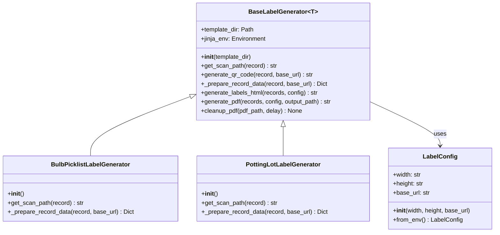
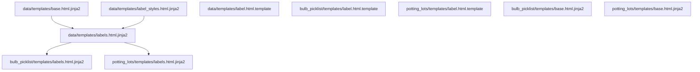

# Doing

## Implement Label Printing for Potting Lots

Implementation completed with the following features:

✅ Created potting_lots module with models.py and repositories.py
✅ Added web pages for list and detail views
✅ Created label template with simplified layout
✅ Set up label generation with QR codes linking to detail pages
✅ Added tests for label generation
✅ Fixed date formatting issues

### Implementation Details

- Used same patterns as bulb picklist feature
- Created simplified label layout as specified
- Labels show plant name, potting ID, bulb code, and a placeholder for plant date
- QR codes link to detail pages
- Added comprehensive tests for label generation functionality

### Next Steps

- Conduct exploratory testing with real data
- Test search fields (opmerking, oppotweek)
- Consider adding aflever_datum in future iterations
- ✅ Refactor code: analyze duplication with bulb label generation

## Refactoring Label Generation Code

After analyzing the code duplication between the bulb picklist and potting lots label generation, we've identified significant overlap in functionality. Here's a design for refactoring this code to reduce duplication while maintaining all existing functionality.

### Current Structure

Currently, we have two separate label generation modules with nearly identical code:
- `src/production_control/bulb_picklist/label_generation.py`
- `src/production_control/potting_lots/label_generation.py`

Both modules contain:
- Identical `LabelConfig` classes
- Very similar `LabelGenerator` classes with minor differences for record-specific fields
- Identical QR code generation logic
- Identical PDF generation logic
- Similar template handling

### Proposed Design

### Key Components

1. **Common Base Module**: Create a new module `src/production_control/data/label_generation.py` containing:
   - `LabelConfig` class (unchanged)
   - Generic `BaseLabelGenerator` class with all common functionality

2. **Specialized Generators**: Refactor existing modules to:
   - Inherit from `BaseLabelGenerator`
   - Implement only the record-specific methods:
     - `get_scan_path`: Returns the URL path for a specific record type
     - `_prepare_record_data`: Prepares record-specific data for templates

3. **Template Handling**: Keep existing templates in their respective modules to maintain separation of concerns.

### Benefits

1. **Reduced Duplication**: Common code is defined once, reducing maintenance overhead
2. **Improved Extensibility**: Adding new label types becomes easier
3. **Consistent Behavior**: QR code generation and PDF creation behave consistently across all label types
4. **Backward Compatibility**: Existing code will continue to work without changes to the API
5. **Type Safety**: Using generics to ensure type safety across different record types

### Implementation Steps

1. Create the base module with common functionality
2. Refactor bulb picklist label generation to use the base module
3. Refactor potting lots label generation to use the base module
4. Update tests to ensure all functionality works as expected
5. Verify backward compatibility with existing code

### Testing Strategy

1. Ensure all existing tests pass after refactoring
2. Add tests for the base module functionality
3. Verify that both label generators produce identical output before and after refactoring

## Template Structure and Inheritance

After analyzing the template structure, we've identified an issue with template inheritance that was causing recursion errors. Here's the current template structure and relationships:

### Template Files and Their Relationships

### Common Templates (src/production_control/data/templates/)

1. **base.html.jinja2**
   - Purpose: Provides the basic HTML structure for all templates
   - Contains: Basic HTML skeleton, page setup, and blocks for title, styles, and content
   - Used by: labels.html.jinja2

2. **labels.html.jinja2**
   - Purpose: Defines the common structure for label pages
   - Extends: base.html.jinja2
   - Contains: Label container, common blocks for header, middle, and bottom sections
   - Used by: Module-specific labels.html.jinja2 templates

3. **label_styles.html.jinja2**
   - Purpose: Contains common CSS styles for labels
   - Included by: labels.html.jinja2

4. **label.html.template**
   - Purpose: Template for individual labels
   - Contains: Basic label structure and styling

### Module-Specific Templates

#### Bulb Picklist (src/production_control/bulb_picklist/templates/)

1. **labels.html.jinja2**
   - Purpose: Customizes labels for bulb picklist records
   - Extends: data/templates/labels.html.jinja2
   - Overrides: title, header_content, middle_left_content, middle_right_content, label_bottom

2. **label.html.template**
   - Purpose: Template for individual bulb picklist labels
   - Contains: Bulb picklist specific label structure

3. **base.html.jinja2** (potentially redundant)
   - Purpose: Duplicate of common base template
   - Status: Should be evaluated for removal

#### Potting Lots (src/production_control/potting_lots/templates/)

1. **labels.html.jinja2**
   - Purpose: Customizes labels for potting lot records
   - Extends: data/templates/labels.html.jinja2
   - Overrides: title, header_content, middle_left_content, middle_right_content, label_bottom

2. **label.html.template**
   - Purpose: Template for individual potting lot labels
   - Contains: Potting lot specific label structure

3. **base.html.jinja2** (potentially redundant)
   - Purpose: Duplicate of common base template
   - Status: Should be evaluated for removal

### Issues Identified

1. **Recursion Error**: Module-specific labels.html.jinja2 templates were extending "labels.html.jinja2" without specifying the path, causing Jinja2 to try to extend themselves.

2. **Template Duplication**: There are duplicate base.html.jinja2 templates in each module that may be unnecessary.

3. **Inconsistent Template Usage**: Some templates are used directly (label.html.template) while others are extended (labels.html.jinja2).

### Fixes Implemented

1. Made template inheritance paths explicit in module-specific labels.html.jinja2 files:
   - Changed `` to ``

### Next Steps: Template Duplication

After fixing the recursion error, we still need to address template duplication:

1. Evaluate and potentially remove redundant base.html.jinja2 templates in module-specific directories
2. Consider consolidating label.html.template files if they share significant structure
3. Create a more consistent template inheritance pattern
4. Implement a common CSS framework for label styling
